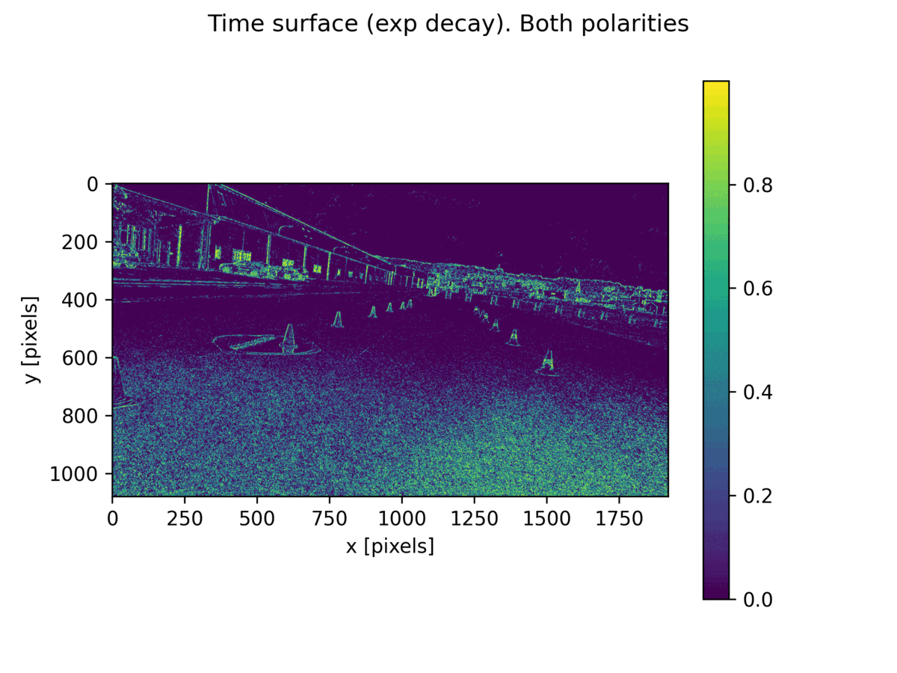

# events_cone_detector

This is a implementation of object detection using events data. 
This is a practice from the AMZ racing team ETHz to see if it is possible to use events camera 
as a possible sensor setup in the future.

For the introduction of events camera and realated paper you can check [here](https://rpg.ifi.uzh.ch/research_dvs.html).

In this work we use yolov5 as the object detection model since its fast inference speed satisfy our real-time requirements.

## Some results
### Result of Events Yolov5 detection

  
Input 
  
Events time surface
 
Detection result

