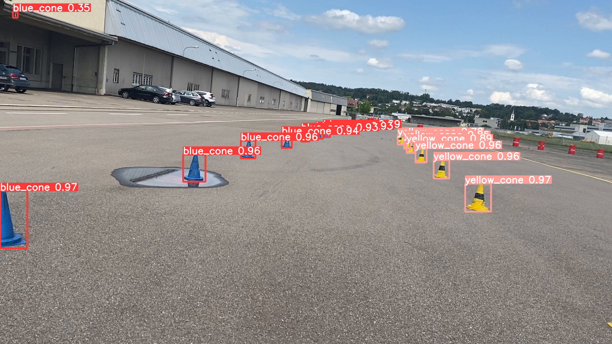

# events_cone_detector

This is a implementation of object detection using events data. 
This is a practice from the AMZ racing team ETHz to see if it is possible to use events camera 
as a possible sensor setup in the future.

For the introduction of events camera and realated paper you can check [here](https://rpg.ifi.uzh.ch/research_dvs.html).

In this work we use yolov5 as the object detection model since its fast inference speed satisfy our real-time requirements.


## Some results
### Result of Events Yolov5 detection

  
Input 
  
Events time surface
 
Detection result


## Pipeline steps
### 1.Events data preparaton
Take a video and simulate the events using the [esim](https://github.com/uzh-rpg/rpg_esim).
Notice that to simulate events we normally need high frame rate video so you should move slowly when you take the video.

### 2. Change it to timesurface representation
After getting the rosbag including events you can change it to txt file for easier usage
```
python bag2txt file.bag

python SAE_dataset_generator.py txt_path timestamps_path
```
You will get timesurface like 

 

More details about timesurface representation can be checked [here](https://www.neuromorphic-vision.com/public/publications/1/publication.pdf)

### 3. Prepare the labels
Note that we still use supervised learning so we need labels for these timesurface images.
So we generate the labels using normal yolov5


time_surface.png

#### 3.1 Training the yolov5 on the normal images to get the label
In this step you can annotate the image youself or use the public data [FSOCO](https://www.fsoco-dataset.com/).
After training you will get the weight. We use the weight to generate the labels for events cone detection.

#### 3.2 Bootstrape the result and clean the prediction.
Next we use the weight you get from last step run the prediction on the events corresponding images.

  
Yolo results.

You might need to clean this labels a bit because we might have some misdetection like below images shows.
  
Yolo results.

For cleanning you can use some label tools like [Supervisely](https://supervise.ly/)
**Note that this step is very important **. Otherwise you might have shit in shit out XD.

As you can the we move the wrong label top left.
 

### 4. Training
Train the weight using the timesurface image and the label come from the normal YOLO.